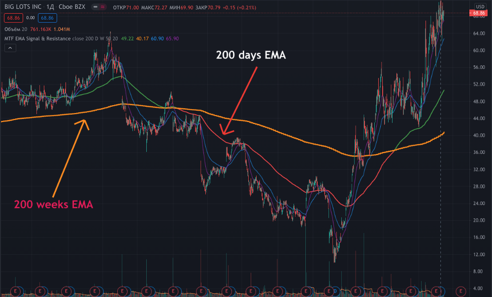
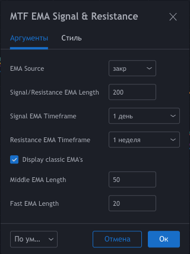

# MTF-EMA-Signal-and-Resistance

[Link to the script on TradingView](https://ru.tradingview.com/script/bjKGx2jN-multi-time-frame-ema-signal-resistance/)

> **Warning: the script is provided for educational purposes only.**

## What it is

The idea of this script is quite simple. Imagine that you have a 200-day EMA and its support or resistance line is the 200-week EMA.
Then if EMA 200 1D > EMA 200 1W then the trend is bullish.

That is, **EMA 200 1D** is the signal line, and **EMA 200 1W** is the resistance.
Of course, you can independently set the time interval for the signal line and resistance, as well as the number of periods.

## Settings

In addition to setting time intervals and period lengths, you can optionally enable the display of additional class EMAs.

You can also set the timeframe for the signal line equal to the current time period.
